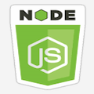

# HW11 Ecommerce Backend - Project

## Project Description

This application should help controll what the user or client interactions when they visit our shopping website. This project will be developed using Git, MySQL, Sequelize, NodeJS, NPM Modules.

---

## Table of Content

1. [Project Description](https://github.com/Brondchux/hw11-ecommerce-backend#project-description)
2. [Author Info](https://github.com/Brondchux/hw11-ecommerce-backend#author-info)
3. [User Story](https://github.com/Brondchux/hw11-ecommerce-backend#user-story)
4. [Acceptance Criteria](https://github.com/Brondchux/hw11-ecommerce-backend#acceptance-criteria)
5. [Mock-Up Preview](https://github.com/Brondchux/hw11-ecommerce-backend#mock-up-preview)
6. [Useful Links](https://github.com/Brondchux/hw11-ecommerce-backend#useful-links)
7. [Tech Stack](https://github.com/Brondchux/hw11-ecommerce-backend#tech-stack)
8. [Credits](https://github.com/Brondchux/hw11-ecommerce-backend#credits)
9. [License](https://github.com/Brondchux/hw11-ecommerce-backend#license)

---

## Author Info

Name: Gospel Chukwu

Email: hello@gospelchukwu.com

Portfolio: [www.gospelchukwu.com](https://brondchux.github.io/hw2-my-portfolio/)

---

## User Story

```md
AS A manager at an internet retail company
I WANT a back end for my e-commerce website that uses the latest technologies
SO THAT my company can compete with other e-commerce companies
```

---

## Acceptance Criteria

```md
GIVEN a functional Express.js API
WHEN I add my database name, MySQL username, and MySQL password to an environment variable file
THEN I am able to connect to a database using Sequelize
WHEN I enter schema and seed commands
THEN a development database is created and is seeded with test data
WHEN I enter the command to invoke the application
THEN my server is started and the Sequelize models are synced to the MySQL database
WHEN I open API GET routes in Insomnia Core for categories, products, or tags
THEN the data for each of these routes is displayed in a formatted JSON
WHEN I test API POST, PUT, and DELETE routes in Insomnia Core
THEN I am able to successfully create, update, and delete data in my database
```

---

## Mock-Up Preview

The following animation shows the application's GET routes to return all categories, all products, and all tags being tested in Insomnia Core:


The following animation shows the application's GET routes to return a single category, a single product, and a single tag being tested in Insomnia Core:


The following animation shows the application's POST, PUT, and DELETE routes for categories being tested in Insomnia Core:


---

## Useful Links

1. 🗂 [Click me to view github repository for this project](https://github.com/Brondchux/hw11-ecommerce-backend/)
2. 🌍 [Click me to view deployed application via heroku](https://live-hw10-employee-management.herokuapp.com/)
3. 📺 [Click me to view application functionality video](https://drive.google.com/file/d/1jxfZMzc1CL2wbDqvFW79Yg0kr4RioqQY/view)

---

## Tech Stack




---

## Credits

Appreciations to Ben 🙌🏾 of [Columbia University, Software Engineering Coding Boot Camp](https://bootcamp.cvn.columbia.edu/coding/landing-ftpt/?s=Google-Brand&msg_cv_scta=4&msg_cv_stbn=1&msg_cv_fcta=1&dki=Learn%20Coding&pkw=%2Bcolumbia%20%2Bcoding%20%2Bbootcamp&pcrid=471112563836&pmt=b&utm_source=google&utm_medium=cpc&utm_campaign=GGL%7CCOLUMBIA-UNIVERSITY%7CSEM%7CCODING%7C-%7COFL%7CTIER-1%7CALL%7CBRD%7CBMM%7CCore%7CBootcamp&utm_term=%2Bcolumbia%20%2Bcoding%20%2Bbootcamp&s=google&k=%2Bcolumbia%20%2Bcoding%20%2Bbootcamp&utm_adgroupid=111600049635&utm_locationphysicalms=9067609&utm_matchtype=b&utm_network=g&utm_device=c&utm_content=471112563836&utm_placement=&gclid=CjwKCAjwlrqHBhByEiwAnLmYUA8CIItksRJF6IT6XMX8WOOJBO-jtCRkzXZhI2gvsZrFEpYdRXy54RoC6jQQAvD_BwE&gclsrc=aw.ds) for being our tutor in this bootcamp.

Special thanks to [Google](https://www.google.com) for helping me find the accurate answers to my questions in a very timely manner.

---

## License

[](https://opensource.org/licenses/MIT)
